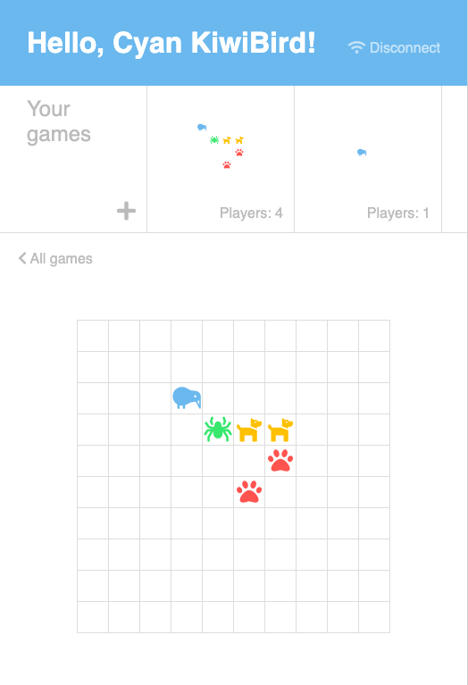

# KitKot — наконец-то можно поиграть в крестики-нолики на котлине



## Почему это здорово

### Любовь к пользователям!

- Не обычные крестики-нолики, а бегемотики-птички: такое понравится каждому. Разных аватаров 200, но эта проблема решается выбором альтернативного варианта при конфликте на одном поле. 
- На одном поле может играть много игроков — так гораздо веселее.
- Если противник долго не ходит, можно создать новую игру и играть там.
- Все ваши игры видны сверху экрана — если что-то начнет происходить, можно быстро переключиться
- Не нужно выбирать игру — есть функция "подключиться к случайной"
- На главном экране видны все поля, а не просто информация — понятно, где будет весело, а куда лучше не лезть. 

### Изоморфность!

`Ktor`-сервер + клиент на `kotlin-react` + `kotlinx.serialization`. `create-react-kotlin-app` не очень хорошо встал в модуль (очень плохо, три дня вкручивал), так что сборка не без трюков. Зато общие классы! 

### Устойчивый риалтайм!

Клиент восстанавливается после проблем с сетью. Вебсокеты + переподключение при разрыве соединения + версионированное хранилище и ручка с событиями. Можно проверить, отключив вебсокет в правом верхнем углу (disconnect), поиграв в другой вкладке, и включив сокет обратно — все изменения подтянутся. 

### Безопасность

Все данные валидируются на сервере, авторизация подписыванным JWT — никакой хакер-семиклассник не сможет всех обыграть, делая ходы не по правилам через апи.

### Redux

Предсказуемый стейт-менеджмент! Обратите внимание на самый эргономичный котлин-thunk: 

```kotlin
fun init() = pThunkify { dispatch ->
        Api.register()
            .then { dispatch(SetUser(it)) }
            .then { Api.loadState() }
            .then { dispatch(ApplySnapshot(it)) }
    }
```

## Что ещё можно было бы сделать

- Технически
    - Нормализовать состояния приложения при передаче: отправлять копии объектов пользователей в поле игры — так себе.
    - На сервере наверняка остались какие-то тредонебезопасные места
    - Прокинуть `mapDispatchToProps` через `rConnect`
    - При прогрузке событий после переподключения скорее всего есть какой-то рейс (событе по сокету пришло, пока грузились изменения).
- Продуктово
    - Устойчивая авторизация (хранить токен на клиенте) 
    - Игра, доступная по устойчивому урлу, чтобы звать друзей через чатик
    - Умный выбор игры при случайном подключении: нужно скорее занять людей, которые создали игру, или откуда вышел игрок.
    - Отложенное создание игры: пустые поля не создаются до первого хода и не занимают место в списке.
    - История ходов и промотка, чтобы вспомнить то место, где всё пошло не так.
    
## Запуск

Gradle-таски:

- `devClient`: Запускает дев-сервер на `localhost:3000` с хот-релоадом
- `run`: Запускает сервер (только апи) на `localhost:8080`
- `runWithClient`: Собирает фронт и запускает сервер с ним на `:8080`, но без хот-релоада.

Стандартный набор для разработки — `devClient` + `run`. Важно, чтобы сервер запустился на `localhost:8080`, а клиент на `localhost:3000`, потому что всё захардкожено.

Версия из `runWithClient` работает на любом хосте / порте. 

Если в идею не подсасываестся типизация `kotlin-wrappers`, нужно руками добавить все js-библиотеки в зависимости модуля `jsMain` 

---

В целом я неплохо повеселился, хотя разобраться в KotlinJS экосистеме было проблематично. Баги на компилятор и пулреквесты на kotlin-wrappers обязательно кину. 
